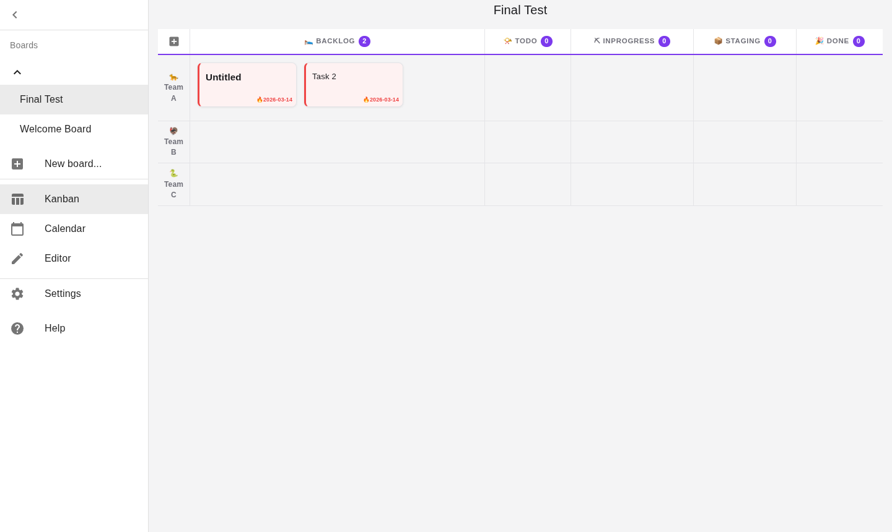

# Kanban Board App


Kanban style task management board app, powered by **PostgreSQL**, **Node.js 22** and a modernized React frontend.



## Features

- Manage tasks with multiple boards and team/story lanes
- Cards with status color stripes and task counter per column
- Write task descriptions in Markdown syntax
- Add QR Code to tasks
- Calendar view
- Dark mode (auto, follows system preference)
- PWA support (installable, offline-ready)
- CI/CD via Jenkins

## Tech Stack

### Frontend
| Technology | Version | Purpose |
|---|---|---|
| React | 17 | UI framework |
| TypeScript | 4 | Type safety |
| Redux + typescript-fsa | — | State management |
| Material-UI (MUI) | v4 | UI components |
| styled-components | 5 | CSS-in-JS |
| marked + DOMPurify | — | Markdown rendering |
| React Router | 5 | Client-side routing |
| Workbox | 6 | PWA / Service Worker |
| Playwright | — | E2E tests |

### Backend
| Technology | Version | Purpose |
|---|---|---|
| Node.js | 22 | Runtime |
| Express | 5 | HTTP server |
| Prisma ORM | 5 | Database access |
| PostgreSQL | 16 | Persistent storage |
| Docker | — | Local dev database |

### Infrastructure
| Technology | Purpose |
|---|---|
| Traefik v3 | Reverse proxy / TLS |
| Jenkins | CI/CD pipeline |
| Docker Compose | Container orchestration |

## Local Development

### 1. Start the database

```sh
cd server
docker-compose up -d
```

### 2. Start the backend

```sh
cd server
npm install
npx prisma generate
npx prisma migrate dev
npm start
```

Backend runs on `http://localhost:3001`.

### 3. Start the frontend

```sh
npm install
npm start
```

Frontend runs on `http://localhost:3000`.

## Architecture

```
Browser → React (Redux) → API calls → Express → Prisma → PostgreSQL
                  ↓
         src/lib/db.ts (bridge: legacy PouchDB calls → REST API)
```

- **Frontend**: React + Redux + TypeScript, code-split by route via `React.lazy`
- **Backend**: Node.js + Express + Prisma ORM
- **Database**: PostgreSQL 16
- **Proxy**: Traefik handles HTTPS and routing in production

## Settings

Tap `Settings` in the sidebar and edit the YAML config.

| Key | Description |
|---|---|
| `display.autoUpdate` | Enable periodic board refresh |
| `display.autoUpdateInterval` | Refresh interval in seconds |

## Author

Maintained by **Leonardo Jaques** — [jaquesprojetos.com.br](https://jaquesprojetos.com.br)

Originally based on [kanban-board-app](https://github.com/shellyln/kanban-board-app) by Shellyl_N (ISC).

## License

[ISC](https://github.com/shellyln/kanban-board-app/blob/master/LICENSE.md)
